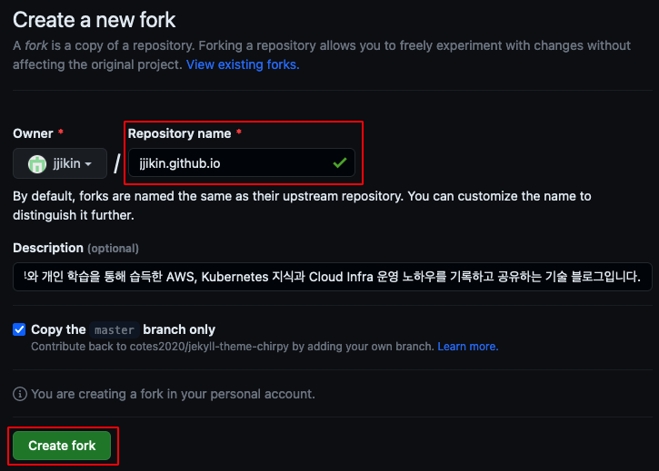
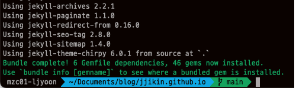
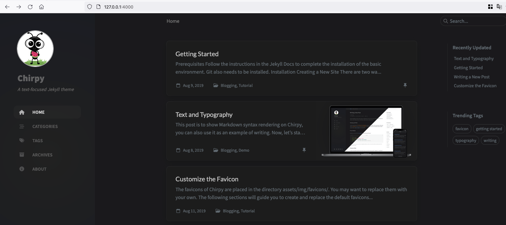
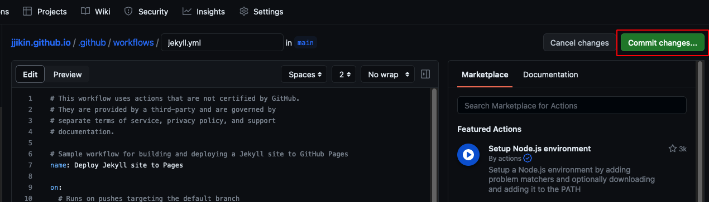

기존 [oopy](https://www.oopy.io/)라는 노션 기반 웹사이트를 통해 블로그를 운영하고 있었는데, 5/25 비용 인상으로 대체제를 찾던 중 Github Pages로 이관하기로 결정했습니다.

이전에도 Github Page를 통한 블로깅을 시도했으나 까다로운 설치와 커스터마이징으로 포기했었기 때문에, 테마 선택 시 사용자 수가 많고 커스터마이징 및 사용 사례 또한 많은 테마인 [Chipy](https://github.com/cotes2020/jekyll-theme-chirpy)를 선택했습니다.

하지만 이번에도 역시 설치과정에서 수많은 오류와 이슈들을 겪었지만...  
어느정도 완성되어 2023년 5월 현재 테마 버전 v6.0.1 기준 설치 방법과 설치 간 겪었던 문제들을 정리해보았습니다.


## 설치 방법

### Local 설치

Chirpy 테마 설치 [방법](https://chirpy.cotes.page/posts/getting-started/)에는 Chirpy Starter와 GitHub Fork 방식이 존재합니다.
Chirpy Starter의 경우 빠르게 구성하여 블로깅할 수 있는 장점이 있지만 커스터마이징이 제한적입니다.<br>따라서 이 포스트에서는 GitHub Fork 방식을 통해 설치합니다.    

1. [링크](https://github.com/cotes2020/jekyll-theme-chirpy/fork)를 통해 Repository를 Fork 합니다.<br>Repository name은 반드시 [github ID].github.io 형식으로 생성해야하며, 설정 후 Create Fork를 선택합니다.




2. branch를 master에서 main으로 변경합니다.


{: .prompt-info}

>  변경하지 않고 Github 배포 시 문제가 발생하는 케이스가 있었습니다.


3. 로컬로 코드를 가져오기 위해 git clone합니다.

```shell
git clone https://github.com/jjikin/jjikin.github.io.git
```


4. git clone 실행 후 경로 내 tools 디렉토리에서 init을 실행하여 기존 설정들을 초기화 합니다.

```shell
 cd ~/Documents/blog/jjikin.github.io/tools
 ./init
```


5. jekyll 실행을 위해 필요한 모듈을 설치합니다.

```shell
 cd ~/Documents/blog/jjikin.github.io
 bundle
```



{: .prompt-danger }

> bundle 실행 전 반드시 ruby 버전이 최소 3 버전 이상인지 체크해야 합니다.
> MacOS(Intel)에는 기본적으로 ruby 2.6 버전이 설치되어 있는데, 이 상태에서 bundle을 통해 모듈을 설치할 경우 Chirpy에서 사용하는 모듈과 호환되지 않아 블로그 기능(다크모드, 검색, 이미지 표시, 모바일 환경 비정상 동작 등)이 정상적으로 동작하지 않습니다.


6. npm을 통해 node.js 모듈을 설치합니다.

```shell
npm install && npm run build
```

{: .prompt-warning }

> node.js 모듈을 설치하지 않으면 assets/js/dist/*.min.js Not Found 에러 발생과 함께 블로그 기능이 정상적으로 동작하지 않습니다.


7. 설치 완료 후 아래 명령어를 통해 로컬에서 jekyll을 실행합니다.

```shell
jekyll serve
```


7. 웹브라우저에서 127.0.0.1:4000 주소로 블로그가 정상적으로 표시되는지 확인하고 블로그 내 여러 메뉴 및 기능들이 정상 동작하는지 확인합니다. 




### Github 배포

로컬에서 테스트한 소스 코드를 Github에 배포합니다.

1. 배포 전 아래와 같이 Settings - Pages - Build and deployment 에서 소스를 GitHub Actions로 변경합니다.


2. Configure를 선택합니다.


3. 별도의 수정 없이 Commit changes...를 선택 후 Commit changes 선택합니다.




{: .prompt-warning }

> GitHub Actions로 소스를 변경하지 않거나, Configure를 완료하지 않고 배포할 경우 아래와 같이 index.html 화면만 표시되니 주의합니다.
>


4. Github에서 jekyll.yml을 생성했으므로 git pull을 통해 로컬 리소스와 동기화를 먼저 진행합니다.

```shell
cd ~/Documents/blog/jjikin.github.io
git pull
```


5. .gitignore 내 assets/js/dist 디렉토리 내 파일들의 Push가 무시되도록하는 설정을 주석처리 합니다.

```yaml
# Bundler cache
.bundle
vendor
Gemfile.lock

# Jekyll cache
.jekyll-cache
_site

# RubyGems
*.gem

# NPM dependencies
node_modules
package-lock.json

# IDE configurations
.idea
.vscode

# Misc
assets/js/dist  ### 주석 처리
```

{: .prompt-warning }

> 로컬에서는 정상 동작했지만(assets/js/dist/*.min.js 파일 존재) Github에는 존재하지 않아 블로그 기능이 정상 동작하지 않았습니다.


6. git 배포를 위해 _posts 경로에 테스트용 포스트를 생성한 후 git push 합니다.

```shell
git add -A
git commit -m "test"
git push
```


6. Github - Actions 탭에서 배포 워크플로우 실행을 확인할 수 있습니다.


또한 모바일에서 확인 시, 메뉴 화면이 접히는 기능 다크/라이트 모드가, 검색기능이 정상적으로 동작하지 않았습니다.


```
# Bundler cache
.bundle
vendor
Gemfile.lock

...

# Misc
# assets/js/dist
```


### 커스터마이징 간 이슈 해결

avator 아이콘이 변경되지 않거나, 포스트 내 이미지에서 The image could not be loaded. 발생하는 경우

_config.xml에서 cdn을 사용하도록 설정되어있으므로, 이를 주석처리


_config.xml 에서 lang을 ko_KR로 변경 시 다크모드, 검색 기능 동작안함


루비 버전 때문에 정말 애를 많이 먹었다. Jekyll이 루비 기반으로 만들어져


Chirpy 테마의 커스터마이징은 아래 블로그를 참고하여 진행하였습니다.

https://www.irgroup.org/categories/chirpy/

이외에도 많은 분들이 사용하는 테마인만큼 커스터마이징과 이슈 해결을 위한 구글링이 매우 수월했습니다.


Chirpy 예제 사이트에서 설치 및 md 작성 방법과 Favicon 등에 대한 소개 페이지를 확인 가능합니다.

https://chirpy.cotes.page/


또한 이슈 발생 시, Github 내 Issue 검색을 통해 트러블슈팅

https://github.com/cotes2020/jekyll-theme-chirpy/issues