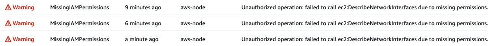
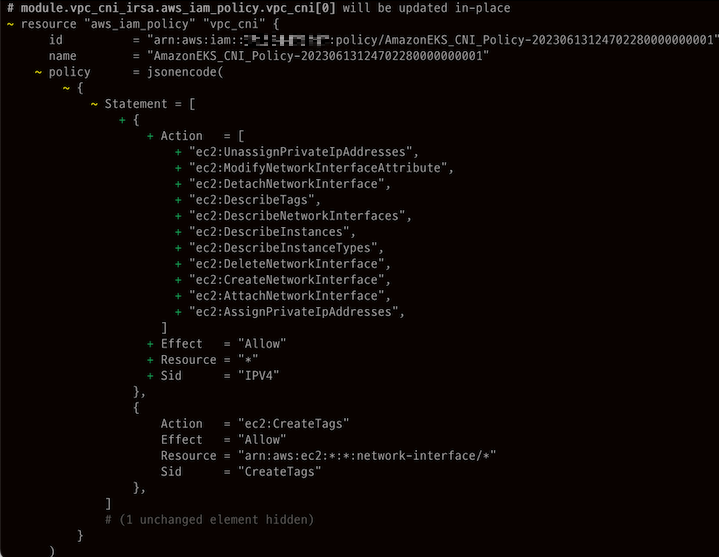

이번 포스트에서는 terraform-aws-modules 기반 EKS 구축 간 겪었던 이슈와 TroubleShooting 과정에 대해 설명합니다.

구축은 아래의 순서대로 진행했습니다.

- module 사용법 파악 및 기본 설정으로 EKS 구축
- 코드 분석 및 리소스 커스터마이징(이름, 설정 등)
- Sockshop 어플리케이션 배포하기
- 기존 Service(nodeport) 환경을 ALB Ingress로 전환
- ALB TLS 적용 및 리다이렉트 설정
- externalDNS + Route53을 활용하여 도메인 적용


## TroubleShooting

### module 사용법 파악 및 기본 설정으로 EKS 구축

- **Public IP 주소 할당 관련 에러**

  {: .prompt-warning }

  > Error: waiting for EKS Node Group (devops-eks-cluster:devops-eks-app-ng) to create: unexpected state 'CREATE_FAILED', wanted target 'ACTIVE'. last error: 1 error occurred:
  >
  > │* subnet-0d5c59c7636cc4ae5, subnet-0fbd28806095278e5: Ec2SubnetInvalidConfiguration: One or more Amazon EC2 Subnets of [subnet-0d5c59c7636cc4ae5, subnet-0fbd28806095278e5] for node group devops-eks-app-ng does not automatically assign public IP addresses to instances launched into it. If you want your instances to be assigned a public IP address, then you need to enable auto-assign public IP address for the subnet. See IP addressing in VPC 

  - 원인  
  퍼블릭 서브넷에 EKS를 구성하는 경우 서브넷 옵션 중 '퍼블릭 IPv4 주소 자동 할당' 설정을 Enabled 하지 않으면 리소스 할당에 실패함.
  - 해결  
  아래와 같이 `vpc.tf` 에 관련 옵션 추가
  
  ```hcl
  # vpc.tf
  module "vpc" {
    source = "terraform-aws-modules/vpc/aws"
    ...  
    map_public_ip_on_launch = true  # 퍼블릭 서브넷 내 생성되는 리소스에 자동으로 퍼블릭 IP 할당
  ```
  
  
  
- **EKS Add-on 중 하나인 coredns가 생성되지 않으며 Timeout 에러**

  {: .prompt-warning }

  > module.eks.aws_eks_addon.this["coredns"]: Still creating... [12m30s elapsed] 

  - 원인
    EKS Console에서 vpc-cni Add-on 로그(aws-node-* pod) 로그 확인 시 아래와 같이 권한 에러가 확인됨
    
    
    특정 권한이 vpc-cni IRSA Role([devops-eks-vpc-cni-irsa-role](https://us-east-1.console.aws.amazon.com/iamv2/home?region=us-east-1#/roles/details/devops-eks-vpc-cni-irsa-role))에 부여되지 않아 발생하는 권한 문제로 추측
    
  - 해결
    [terraform-aws-module github](https://github.com/terraform-aws-modules/terraform-aws-eks/blob/master/docs/irsa_integration.md)에서 IRSA 관련 사용 예시를 확인한 후, `vpc_cni_enable_ipv4 = true` 옵션을 추가
  ```hcl
  # eks.tf
  ...
  module "vpc_cni_irsa_role" { 
    source = "terraform-aws-modules/iam/aws//modules/iam-role-for-service-accounts-eks"
    ...
    vpc_cni_enable_ipv4   = true
  ```
    terraform plan 시 아래와 같이 IP 할당과 관련된 권한이 추가됨을 확인할 수 있었습니다.
    


  

- **kubectl 명령어 사용을 위해 EKS 클러스터 내 kubeconfig 업데이트 시 apiVersion 에러**  
  
  `aws eks update-kubeconfig --name devops-eks-cluster --profile ljyoon`
  
  {: .prompt-warning }
  
  > error: exec plugin: invalid apiVersion "client.authentication.k8s.io/v1alpha1"
  
  - 원인 : 내 Mac에 설치된 kubectl 버전과, EKS 내 kubectl 버전이 맞지 않아 발생하는 것으로 추측
  
  - 해결 : Mac 내 설치된 kubectl 버전 확인 `kubectl version --client`
  
    WARNING: This version information is deprecated and will be replaced with the output from kubectl version --short. Use --output=yaml|json to get the full version.
    Client Version: version.Info{Major:"1", Minor:"25", **GitVersion:"v1.25.9",** GitCommit:"a1a87a0a2bcd605820920c6b0e618a8ab7d117d4", GitTreeState:"clean", BuildDate:"2023-04-12T12:16:51Z", GoVersion:"go1.19.8", Compiler:"gc", Platform:"darwin/amd64"} Kustomize Version: v4.5.7
  
    최신 버전으로 업그레이드 시에도 동일 에러 발생
  
    [구글링]( https://github.com/aws/aws-cli/issues/6920 ) 시 버전 호환 이슈가 있어 1.23.6으로 다운그레이드 후 API 정상 호출 확인
    


- Helm 최신 버전 설치 후 loadbalancer-controller 설치 시 apiVersion 에러

  {: .prompt-warning }

  > Error: INSTALLATION FAILED: Kubernetes cluster unreachable: exec plugin: invalid apiVersion "client.authentication.k8s.io/v1alpha1"

  Helm 버전 다운그레이드(v3.12.0 → v3.8.2) 하여 해결

  ```shell
  curl -fsSL -o get_helm.sh https://raw.githubusercontent.com/helm/helm/main/scripts/get-helm-3
  chmod 700 get_helm.sh
  DESIRED_VERSION=v3.8.2 bash get_helm.sh
  ```

  

- **loadbalancer-controller Deployment가 정상적으로 실행되지 않는 문제**

  {: .prompt-warning }

  > NAME                                            READY   UP-TO-DATE   AVAILABLE   AGE 
  >
  > aws-load-balancer-controller    0/2         0                       0                    84s

  - 원인

    describe 시 별 로그가 기록되지 않았고, 파드가 실행되지 않아 파드 로그 확인 불가
    관련 리소스 체킹 중 k8s 내 loadbalancer-controller 관련 ServiceAccount가 생성되지 않았음
  
    terraform-aws-modules/iam/.../iam-role-for-service-accounts-eks 모듈에서 생성하는 리소스 확인 시 SA Resource 정의가 없음(vpc-cni는 자동 생성된 것 같은데...)
  
    
  
  - 해결 
  
    아래와 같이 수동으로 정의 후 배포하고, LB Controller 재설치 시 정상적으로 파드가 올라오는 것을 확인
  ```hcl
  # eks.tf
  ...
  resource "kubernetes_service_account" "aws-load-balancer-controller" {
    metadata {
      name        = "aws-load-balancer-controller"
      namespace   = "kube-system"
      annotations = {
        "eks.amazonaws.com/role-arn" = module.load_balancer_controller_irsa_role.iam_role_arn  # irsa 생성 모듈에서 output으로 iam_role_arn을 제공한다.
      }
      labels = {
        "app.kubernetes.io/component" = "controller"
        "app.kubernetes.io/name" = "aws-load-balancer-controller"
      }
    }
    depends_on = [module.load_balancer_controller_irsa_role]
  }
  ```
  
  
