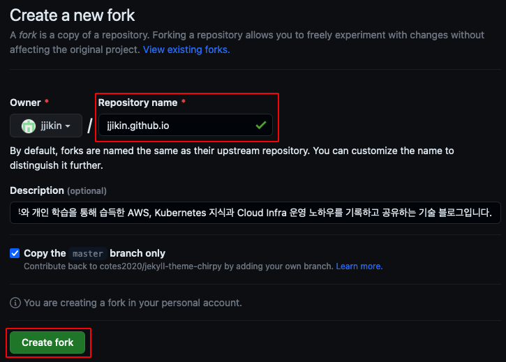
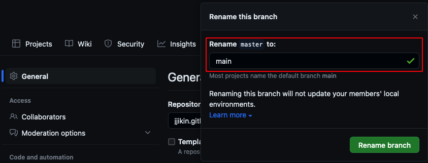
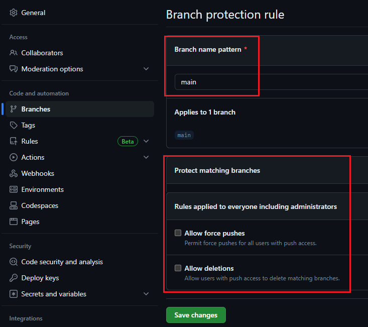
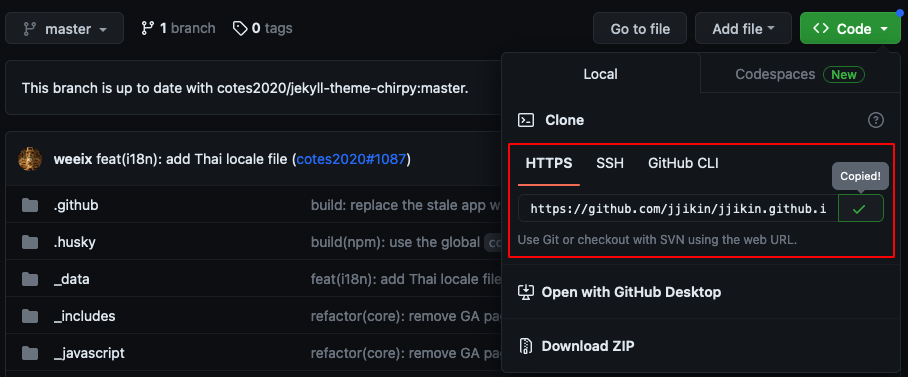
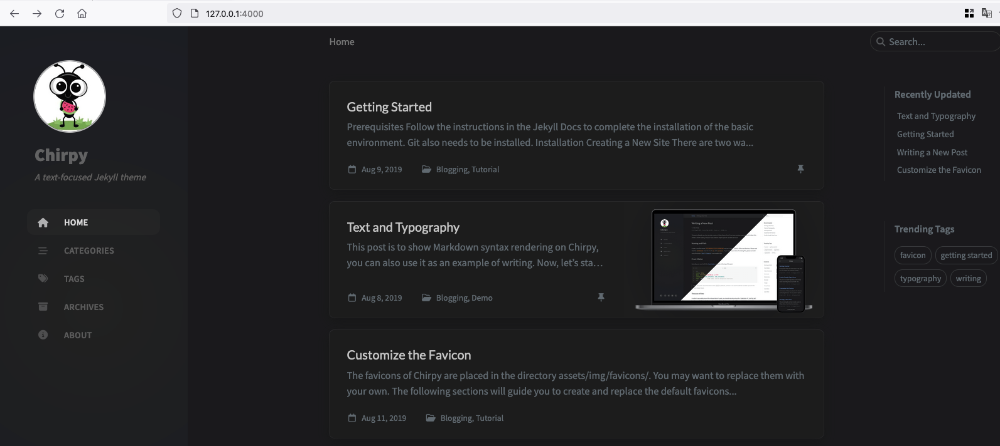
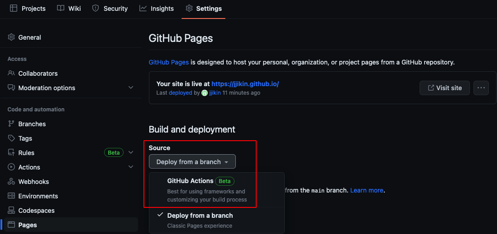
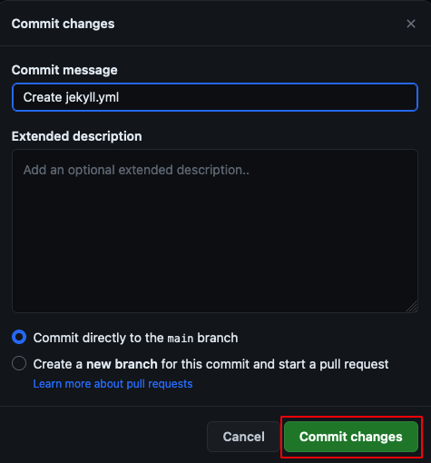
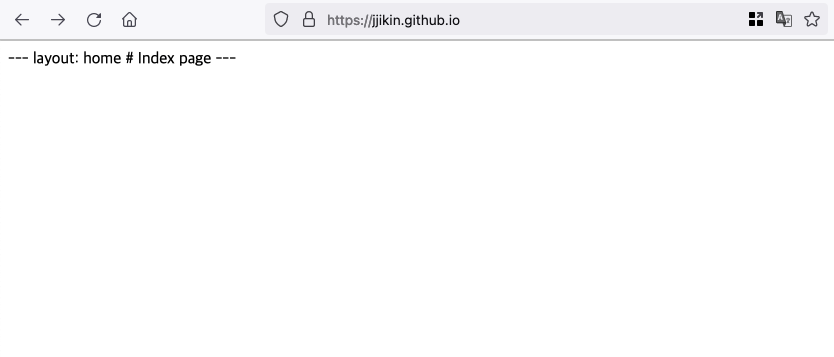
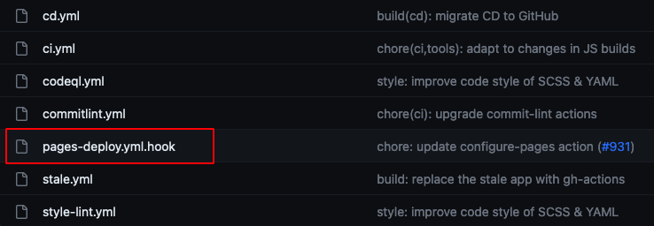
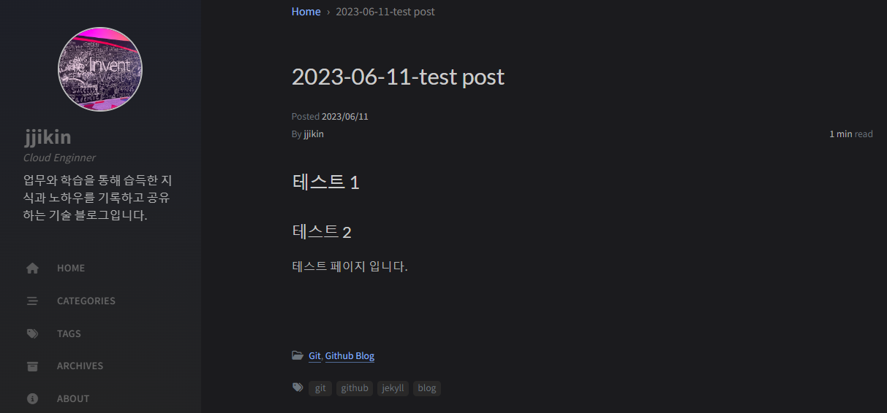

기존 [oopy](https://www.oopy.io/)라는 노션 기반 웹사이트를 통해 블로그를 운영하고 있었는데, 5/25 비용 인상으로 대체제를 찾던 중 Github Pages로 이관하기로 결정했습니다.

이전에도 Github Page를 통한 블로깅을 시도했으나 까다로운 설치와 커스터마이징으로 포기했었기 때문에, 테마 선택 시 사용자 수가 많고 커스터마이징 및 사용 사례 또한 많은 테마인 [Chipy](https://github.com/cotes2020/jekyll-theme-chirpy)를 선택했습니다.

하지만 이번에도 역시 설치과정에서 수많은 오류와 이슈들을 겪었지만...  
어느정도 완성되어 2023년 6월 현재 테마 버전 v6.0.1 기준 설치 방법과 설치 간 겪었던 문제들을 정리해보았습니다.  

<br>

<br>

## 설치 방법

### Local 설치

Chirpy 테마 설치 [방법](https://chirpy.cotes.page/posts/getting-started/)에는 Chirpy Starter와 GitHub Fork 방식이 존재합니다.
Chirpy Starter의 경우 빠르게 구성하여 블로깅할 수 있는 장점이 있지만 커스터마이징이 제한적입니다.<br>따라서 이 포스트에서는 GitHub Fork 방식을 통해 설치합니다.    

1. [링크](https://github.com/cotes2020/jekyll-theme-chirpy/fork)를 통해 Repository를 Fork 합니다.<br>Repository name은 반드시 [github ID].github.io 형식으로 생성해야하며, 설정 후 Create Fork를 선택합니다.
   

   <br>

2. branch를 master에서 main으로 변경하고 Branch protection rule도 기본값(체크 X)으로 설정합니다.
   
   
   
   <br>

3. 로컬로 코드를 가져오기 위해 git clone합니다.

   ```shell
   $ git clone https://github.com/jjikin/jjikin.github.io.git
   ```

   

   <br>

4. jekyll 실행을 위해 필요한 모듈을 설치합니다.

   ```shell
   $ cd ~/Documents/blog/jjikin.github.io
   $ bundle
   ```

   

   {: .prompt-warning }

   > bundle 실행 전 반드시 ruby 버전이 최소 3 버전 이상인지 체크해야 합니다.  
   > MacOS(Intel)에는 기본적으로 ruby 2.6 버전이 설치되어 있는데, 이 상태에서 bundle을 통해 모듈을 설치할 경우 Chirpy에서 사용하는 모듈과 호환되지 않아 블로그 기능(다크모드, 검색, 이미지 표시, 모바일 환경 비정상 동작 등)이 정상적으로 동작하지 않습니다.

   <br>

5. npm을 통해 node.js 모듈을 설치합니다.

   ```shell
   npm install && npm run build
   ```

   {: .prompt-warning }

   > node.js 모듈을 설치하지 않으면 assets/js/dist/*.min.js Not Found 에러 발생과 함께 블로그 기능이 정상적으로 동작하지 않습니다.

   <br>

6. 설치 완료 후 아래 명령어를 통해 로컬에서 jekyll을 실행합니다.
   ```shell
   jekyll serve
   ```

   

   <br>

7. 웹브라우저에서 127.0.0.1:4000 주소로 블로그가 정상적으로 표시되는지 확인하고 블로그 내 여러 메뉴 및 기능들도 정상 동작하는지 확인합니다. 



 <br>

<br>

### Github 배포

로컬에서 테스트한 소스 코드를 Github에 배포합니다.

1. 배포 전 아래와 같이 Settings - Pages - Build and deployment 에서 소스를 GitHub Actions로 변경합니다.

   

   <br>

2. Configure를 선택합니다.

   

   <br>

3. 별도의 수정 없이 Commit changes...를 선택 후 Commit changes 선택합니다.

   

   

   {: .prompt-warning }

   > GitHub Actions로 소스를 변경하지 않거나, Configure를 완료하지 않고 배포할 경우 아래와 같이 index.html 화면만 표시되니 주의합니다.

   

   <br>

4. 기존 배포 방식(Deploy form a branch)에 사용되던 파일(pages-deploy.yml.hook)을 삭제합니다.

   

   <br>

5. Github에서 jekyll.yml을 생성했으므로 git pull을 통해 로컬 리소스와 동기화를 먼저 진행합니다.

   ```shell
   cd ~/Documents/blog/jjikin.github.io
   git pull
   ```

   

   <br>

6. .gitignore 내 assets/js/dist 디렉토리 내 파일들의 Push가 무시되도록하는 설정을 주석처리 합니다.

   ```shell
   # Bundler cache
   .bundle
   vendor
   Gemfile.lock
   
   # Jekyll cache
   .jekyll-cache
   _site
   
   # RubyGems
   *.gem
   
   # NPM dependencies
   node_modules
   package-lock.json
   
   # IDE configurations
   .idea
   .vscode
   
   # Misc
   # assets/js/dist  ### 주석 처리
   ```

   {: .prompt-warning }

   > 로컬에서는 assets/js/dist/*.min.js 파일이 존재하여 정상 동작했지만, 위 설정을 하지 않고 배포할 경우 Github에는 해당 파일이 push되지 않으므로 블로그 기능이 정상 동작하지 않습니다.

   <br>

7. git 배포를 위해 _posts 경로에 테스트용 포스트를 생성한 후 git push 합니다.

   ```shell
   git add -A
   git commit -m "test"
   git push
   ```

   

   <br>

8. Github - Actions 탭에서 배포 워크플로우 실행을 확인할 수 있습니다.

   

   <br>

9. 테스트 페이지 및 블로그 기능이 정상 동작하는지 확인합니다.

   

<br>

<br>

## 마무리

많은 유저가 사용하는 테마인만큼 커스터마이징과 이슈 해결을 위한 구글링이 매우 수월했습니다.

Chirpy 예제 사이트에서 설치 및 md 작성 방법과 Favicon 등에 대한 [소개 페이지](https://chirpy.cotes.page/)를 확인 가능합니다.

또한 에러 발생 시, [Github 내 Issue](https://github.com/cotes2020/jekyll-theme-chirpy/issues) 검색을 통해 트러블슈팅하면 대부분 에러들은 해결 가능했습니다.

<br>

<br>


## 커스터마이징 간 이슈 해결

Chirpy 테마의 커스터마이징은 하얀눈길님 [블로그](https://www.irgroup.org/categories/chirpy/)를 참고하여 진행하였습니다. 이후 커스터마이징 하면서 겪었던 내용들을 업데이트할 예정입니다.


- **avatar 아이콘이 변경되지 않거나, 포스트 내 이미지에서 `The image could not be loaded.`  에러 발생하는 경우**

  _config.xml에서 cdn을 사용하도록 설정되어있으므로, 이를 주석처리